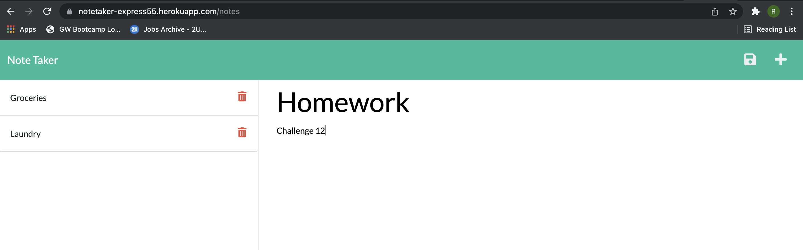

# Team Generator
  

  ## Table of Contents 
  * [Description](#description)
  * [Usage](#usage)
  * [Installation](#installation)
  * [Tests](#tests)
  * [Contributions](#contributions)
  * [License](#license)
  * [Questions](#questions)

  ## Photos
  

  ## Description
  The application allows a user to take notes on tasks they need to complete. The user can also delete the note when it is no longer relevant.

  ## Usage
  Simply start typing a note in the text field and click the save button in the top right and the note will save in the left hand side bar.

  ## Installation
Please install Express JS in order to run this project.

  ## Tests
  No tests applicable 
  
  ## Contributions
  Open to all contributions.

  ## License
  This project abides by the - MIT License. To see more information, click on the badge link at the top of the page.

  ## Questions
  Please contact me at rdenton3@terpmail.umd.edu with any further questions. 
  Github link - https://github.com/rdenton3
